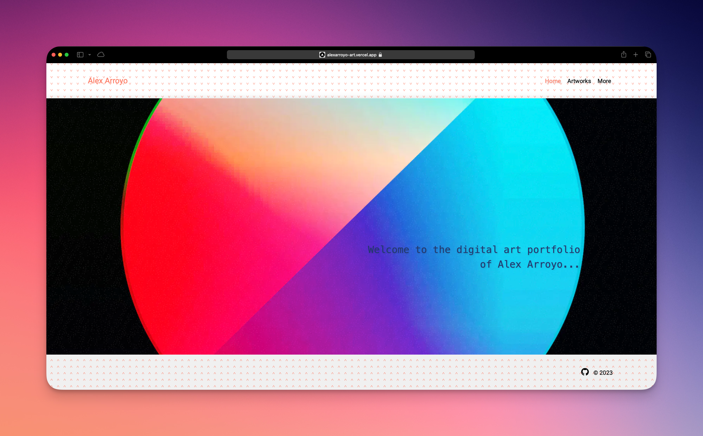

# Digital Art Portfolio

This is a digital art portfolio website created by Alex Arroyo. It showcases a collection of digital artworks in a visually appealing manner.

## Tools used

This portfolio website is built using Next.js, a popular React framework for building web applications. It features a clean and responsive design that highlights the artworks. The website includes a main landing page, an artworks gallery, and additional information about the artist.

## Live preview

Check the web site here: https://github.com/alexaldearroyo/art_portfolio

---

© 2023 Alex Arroyo